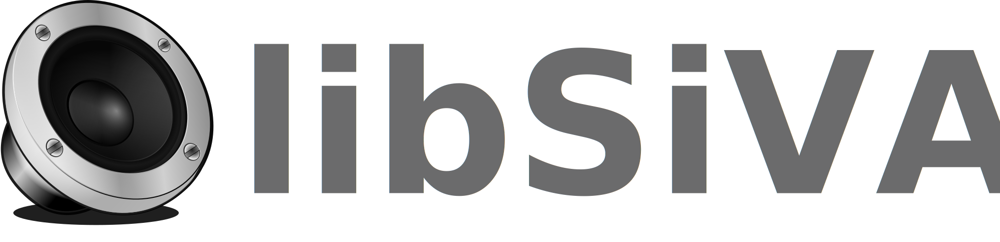

A modern, header-driven C++23 library for the electro-acoustic simulation and analysis of loudspeaker systems.

---

## About The Project

**libSiVAL** (Simulation, Visualisation and Analysis Software for Loudspeaker) is a specialized tool for the systematic planning and technical verification of loudspeaker enclosures and their drivers. It was established to replace the traditional method of trial-and-error with a reliable, digital foundation for acoustic design.

The library functions as a virtual acoustic laboratory, accepting the technical specifications of a driver (via JSON) and the parameters of an enclosure. It then conducts a comprehensive simulation of the coupled electro-mechanical-acoustic system, allowing designers to predict and optimize performance prior to physical construction.

## Features

* **Systematic Simulation:** Models sealed and (planned) vented enclosures.
* **Data-Driven:** Uses easy-to-understand JSON files for all driver parameters.
* **Key Metrics:** Accurately calculates critical responses like Sound Pressure Level (SPL), electrical impedance, and cone excursion.
* **Modern C++:** Built with a clean C++23 architecture, leveraging smart pointers for safe memory management and a robust exception system.
* **Decoupled Design:** A clear separation of concerns between core logic, components (drivers, enclosures), and analysis (responses).

## Getting Started

To get a local copy up and running, follow these simple steps.

### Prerequisites

* A C++23 compatible compiler (e.g., GCC 13+, Clang 17+, MSVC v17.6+).
* CMake (version 3.16 or higher).
* [nlohmann/json](https://github.com/nlohmann/json) library (the project is set up to fetch this automatically via CMake's `FetchContent`).

### Building

1.  Clone the repository:
    ```sh
    git clone [https://github.com/Ayandorias/libsival.git](https://github.com/Ayandorias/libsival.git)
    ```
2.  Navigate to the project directory:
    ```sh
    cd libsival
    ```
3.  Configure the project with CMake:
    ```sh
    cmake -B build
    ```
4.  Compile the library and examples:
    ```sh
    cmake --build build
    ```

## Quick Start: Usage Example

The following example demonstrates the basic workflow of creating a setup, adding a driver, and preparing for simulation.

```cpp
#include <iostream>
#include <fstream>
#include <string>
#include "sival/core/AcousticSetup.hpp"
#include "sival/core/exceptions.hpp"

// Helper function to read a file into a string
std::string readFile(const std::string& path) {
    std::ifstream file(path);
    if (!file.is_open()) {
        throw std::runtime_error("Could not open file: " + path);
    }
    return std::string((std::istreambuf_iterator<char>(file)), std::istreambuf_iterator<char>());
}

int main() {
    try {
        // 1. Create a new setup for a sealed enclosure
        SiVAL::AcousticSetup setup(SiVAL::ENCLOSURE_TYPE::ENC_SEALED);

        // 2. Configure the enclosure
        // Get a reference to the enclosure and modify its properties
        SiVAL::AbstractEnclosure& enclosure = setup.enclosure();
        enclosure.setVolume(30.0); // Set volume to 30 liters

        // 3. Load driver data from a file and add it to the setup
        std::string driverJson = readFile("path/to/your/driver.json");
        setup.addDriver(SiVAL::DriverRole::WOOFER, driverJson);

        std::cout << "Setup created successfully with one woofer in a 30L sealed enclosure." << std::endl;

        // 4. (Next Step) Add a response calculation
        // setup.addResponse(std::make_unique<SiVAL::Response::SPL::Sealed>(...));
        
        // 5. (Next Step) Get and process the results
        // auto* splResponse = setup.responseByType(SiVAL::RESPONSE_TYPE::RES_FREQ);
        // ...

    } catch (const SiVAL::Exception& e) {
        // Catch any specific library errors
        std::cerr << "A libSiVAL error occurred: " << e.what() << std::endl;
        return 1;
    } catch (const std::exception& e) {
        // Catch any other standard errors (e.g., file not found)
        std::cerr << "An error occurred: " << e.what() << std::endl;
        return 1;
    }

    return 0;
}
```

## Roadmap

The current focus is on establishing a stable core for the first release.

* [x] Core architecture design (`AcousticSetup`, Factories, Exceptions).
* [ ] **Version 0.1:** Full implementation and validation for **Sealed Enclosures**.
* [ ] Future: Implementation for Vented Enclosures.
* [ ] Future: Advanced response calculations (Group Delay, Power Compression).

See the [open issues](https://github.com/Ayandorias/libsival/issues) for a full list of proposed features (and known issues).

## Contributing

Contributions are what make the open-source community such an amazing place to learn, inspire, and create. Any contributions you make are **greatly appreciated**.

If you have a suggestion that would make this better, please fork the repo and create a pull request. You can also simply open an issue with the tag "enhancement".
Please read the `CONTRIBUTING.md` for details on our code of conduct and the process for submitting pull requests.

## License

Distributed under the GNU Lesser General Public License v3.0. See `LICENSE` for more information.

## Contact

Bruno Pierucki - b.pierucki@gmx.de

Project Link: [https://github.com/Ayandorias/libsival](https://github.com/Ayandorias/libsival)
